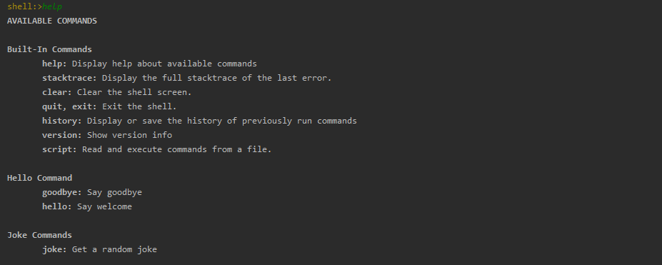
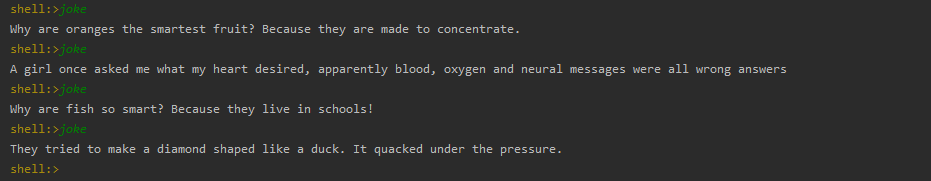

# My Shell

## Description
`My Shell` is a simple shell application that I wrote using `Spring Shell` and `Spring Boot`.

## Installation and Usage
1. Clone the repository
    `git clone https://github.com/ivandi1980/my-shell.git`
2. Run `mvn clean install` or if you're using `IntelliJ` just run the `main` method in `MyShellApplication.java`
3. Run `java -jar target/my-shell-0.0.1-SNAPSHOT.jar`
4. Run `help` to see the list of available commands
5. Run `exit` to exit the shell
6. Run `mvn clean` to clean the project

## Screenshots

## License
This project is licensed under the MIT License

## Acknowledgments
* [Spring Shell](https://projects.spring.io/spring-shell/)
* [Spring Boot](https://projects.spring.io/spring-boot/)
* [Spring Initializr](https://start.spring.io/)

## Author & Reviewers
* [ivandjoh](https://linkedin.com/in/ivandjoh)
* [delvin](https://github.com/delvincakep)